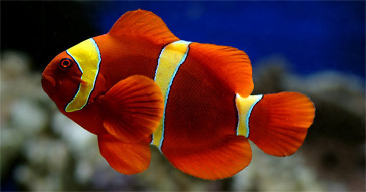

### nlp-stanford by fish.ai

### Language Java 1.8

### Use Cases

1. Generate Conll Corupus (package name com.fish.ai.nlp.core.conll.generation)
2. Coreference resolution (com.fish.ai.nlp.coref)
3. Sentiment Analysis (com.fish.ai.nlp.sentiment)
4. Questin Understanding (NLU) com.fish.ai.nlu.question.understanding

#### NOTE conll corpus you can use to train a Relation Extractor
1. [Stanford Relation Extractor](https://nlp.stanford.edu/software/relationExtractor.html)

### References
1. [Coreference resolution Stanford CoreNLP](https://nlp.stanford.edu/projects/coref.shtml)
2. [Stanford TokensRegex](https://nlp.stanford.edu/software/tokensregex.html)
3. [Stanford RegexNER](https://nlp.stanford.edu/software/regexner.html)
4. [Stanford Sentiment Analysis](https://nlp.stanford.edu/sentiment/)

[ LinkedIn](https://www.linkedin.com/in/iitrsamrat/)
